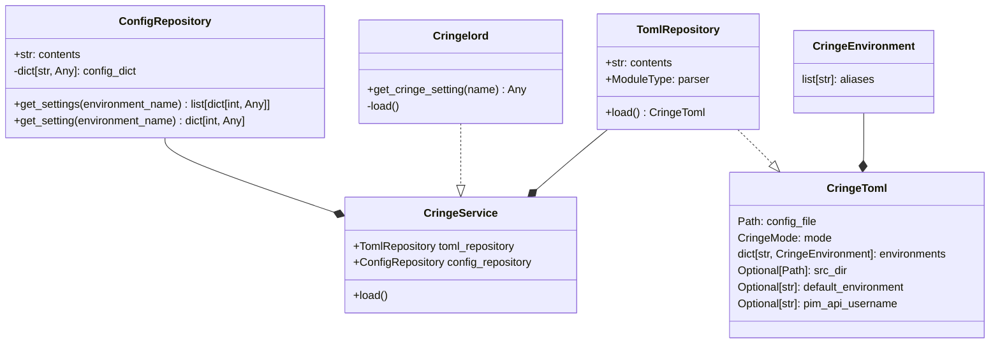
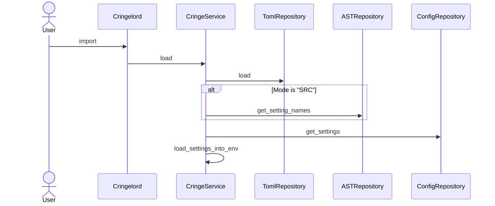

# Diagrams

## Classes

```mermaid
classDiagram
    class Cringelord {
        +get_cringe_setting(name) Any
        -load()
    }
    
    class CringeEnvironment {
        list[str]: aliases
    }
    
    class CringeToml {
        Path: config_file
        CringeMode: mode
        dict[str, CringeEnvironment]: environments
        
        Optional[Path]: src_dir
        Optional[str]: default_environment
        Optional[str]: pim_api_username
    }
    
    class TomlRepository {
        +str: contents
        +ModuleType: parser
        
        +load() CringeToml
    }
    
    class ConfigRepository {
        +str: contents
        
        -dict[str, Any]: config_dict
        
        +get_settings(environment_name) list[dict[int, Any]]
        +get_setting(environment_name) dict[int, Any]
    }
    
    class CringeService {
        +TomlRepository toml_repository
        +ConfigRepository config_repository
        
        +load()
    }
    
    TomlRepository --* CringeService
    ConfigRepository --* CringeService
    CringeEnvironment --* CringeToml
    TomlRepository ..|> CringeToml
    Cringelord ..|> CringeService
```

## Flow
### Load

```mermaid
sequenceDiagram
    actor User
    
    User->>Cringelord: import
    Cringelord->>CringeService: load
    CringeService->>TomlRepository: load
    alt Mode is "SRC"
    CringeService->>ASTRepository: get_setting_names
    end
    CringeService->>ConfigRepository: get_settings
    CringeService->>CringeService: load_settings_into_env
```
